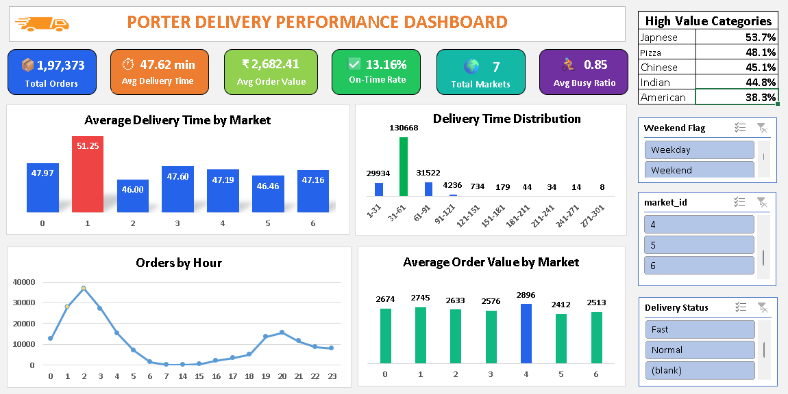

# Porter Delivery Time Analysis

## Project Overview
This project analyzes Porter delivery operations data to identify the factors affecting delivery performance, order value, and operational efficiency. The analysis was conducted using Microsoft Excel 2019 with Power Query, Pivot Tables, Charts, and Statistical Analysis techniques.

The objective of this project is to generate business insights that can help improve delivery operations, partner utilization, and revenue generation strategies.

---

## Dataset Information

- **Dataset Name:** Porter Delivery Dataset
- **Total Records:** 197,373 Orders
- **Total Columns:** 14
- **Time Period:** January 2015 to February 2015
- **Tool Used:** Microsoft Excel 2019

### Dataset Columns

- market_id
- created_at
- actual_delivery_time
- store_id
- store_primary_category
- order_protocol
- total_items
- subtotal
- num_distinct_items
- min_item_price
- max_item_price
- total_onshift_partners
- total_busy_partners
- total_outstanding_orders

---

## Data Cleaning

The following data cleaning steps were performed:

- Removed duplicate records.
- Checked missing values in all important columns.
- Verified date and time formats.
- Identified invalid negative values in partner availability columns.
- Investigated inconsistencies in price range calculations.
- Validated delivery time calculations.

### Data Quality Observations

- No duplicate records were found.
- Approximately 790 records produced negative price ranges due to inconsistencies between `min_item_price` and `max_item_price`.
- A small number of negative partner availability values were identified and treated as data quality issues.

---

## Feature Engineering

The following derived columns were created:

| Feature | Description |
|---------|-------------|
| Order Hour | Hour extracted from order timestamp |
| Order Day | Day of week of the order |
| Month | Order month |
| Weekend Flag | Weekend vs Weekday classification |
| Price Range | Difference between max and min item price |
| Busy Ratio | Busy partners divided by on-shift partners |
| Delivery Status | On-Time or Delayed delivery flag |

---

## Key Business Questions Answered

### Basic Questions
1. Order distribution across markets.
2. Delivery performance by store category.
3. Order distribution by hour.
4. Delivery time distribution analysis.
5. Relationship between total items and subtotal.
6. On-time delivery performance.
7. Impact of busy delivery partners.
8. Delivery performance by weekday.
9. Top categories with longest delivery times.

### Medium Questions
1. Efficiency of order protocols.
2. Average order value across markets.
3. Impact of on-shift partners during peak hours.
4. Effect of order complexity on delivery times.
5. Weekly delivery time trends.
6. Impact of item price range on order value.
7. Store categories generating high-value orders.
8. Delivery time variance across markets and categories.
9. Impact of partner availability on delivery times.
10. First-time vs repeat customer analysis (not possible due to missing customer identifiers).

---

## Key Findings

### Delivery Performance
- Average delivery time was **47.62 minutes**.
- Most orders were delivered within **31–61 minutes**.
- Delivery times remained stable across weekdays.

### Order Complexity
- Total items and distinct items showed weak positive correlations with delivery times:
  - Total Items vs Delivery Time: **0.118**
  - Distinct Items vs Delivery Time: **0.156**

### Revenue Drivers
- Price Range and Order Value showed a moderate positive correlation:
  - Price Range vs Subtotal: **0.510**

### High Value Categories
Categories with the highest proportion of above-average orders:
- Japanese
- Pizza
- Chinese
- Indian

### Delivery Variability
- Market 1 showed the highest delivery time variability.
- Afghan, Tapas, and Convenience Store categories exhibited the highest service inconsistency.

### Partner Availability
- High delivery partner utilization did not always result in slower deliveries.
- Operational efficiency appeared to be more important than partner availability alone.

---

## Tools & Techniques Used

### Excel Features
- Power Query
- Pivot Tables
- Pivot Charts
- Slicers
- Conditional Formatting
- Statistical Functions

### Excel Functions
- IF()
- COUNTIF()
- CORREL()
- AVERAGE()
- STDEV()
- MIN()
- MAX()
- HOUR()
- TEXT()

---
## Dashboard
The dashboard provides an interactive overview of Porter Delivery's operational performance, enabling stakeholders to monitor delivery efficiency, market performance, demand trends, and revenue insights.




## Project Structure

``` text
porter-delivery-analysis/
├── Data/
│   ├── Raw Data/
│   └── Clean Data/
|
├── Data/
|   └── Porter_business_rewuirements.pdf/
|
├── Excel/
│   ├── Porter_Delivery_Analysis.xlsx
|   ├── Basic_Ques_Analysis.xlsx
|   ├── Medium_Ques_Analysis.xlsx
│   └── Dashboard.xlsx
|
├── Images/
│   └── Dashboard_image.png
|
├── Reports/
│   └── Porter_Delivery_Project_Report.pdf
|
├── .gitignore
| 
└── README.md
```

## Author

**Utkarsh Dhangar**